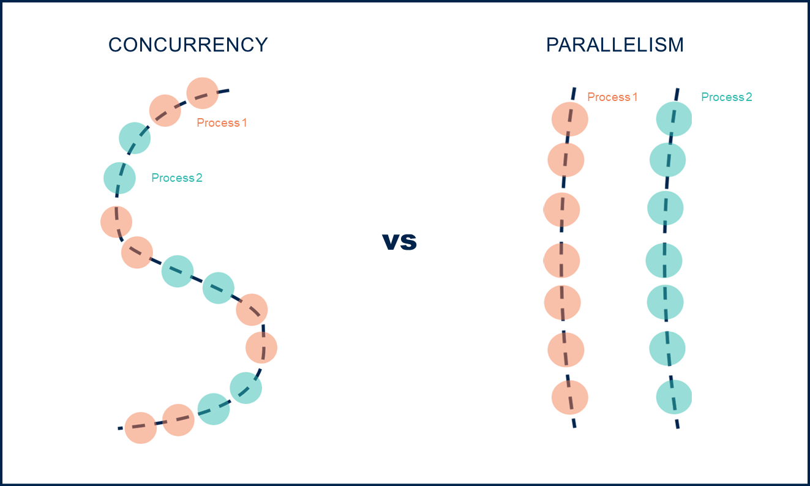
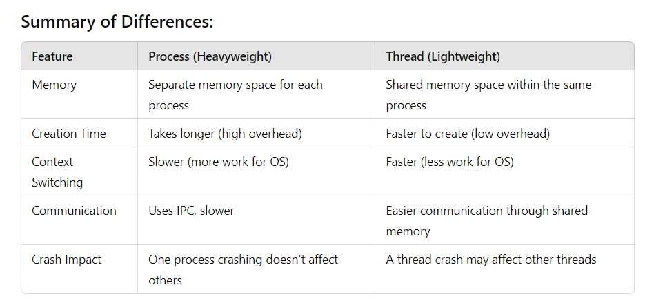
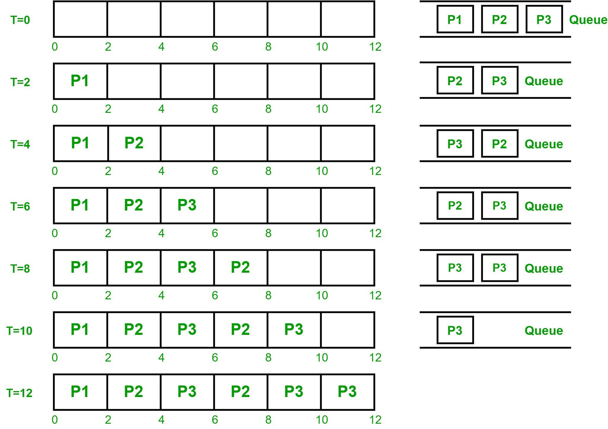

<p style="text-align:center;" align="center"><picture>
</picture><br /><br /></p>
<p align="center">
<h1 align="center">
    MultiThreading For Backend Engineering
</h1>

### Motivation for multithreading
<p>
By default programming languages are sequential in nature.
<br>
Code execution happens linr by line usual scenario.
<br>
Consider the following code:
</p>

```java
public class Runner{
    public static static void main(String[] args) {
        initDB();
        downloadDB();
        processData();
        displayResults();
    }
}
```

Show in the above code snippet we see that all the methods will be called line by line.
<br>Firstly `initDB()` will be invoked, then `downloadDB()`, `processDB()` and finally
`displayResults()` will be called!.
<br>

_But there is Problem here_:
<br>In a single threaded program these instructions will be executed one by one.
The time-consuming sections can freeze the entire application!
<br>

_What's the solution_:
<br>
Figure out the time-consuming tasks and decide if they can be run seperately.
<br>
If yes, then run such task in different thread(s).
<br>

So the change that we can make in the above block of code is to put the `downloadDB()`
in a separate thread as the downloading of data might tke certain time!, and all the other
methods in another thread(). This way we are not freezing the execution of our program.
<br>

### Define Multithreading
Multithreading is the ability of the cpu to perform different tasks concurrently.

--- 
## Concurrency Vs Parallelism
### Defining concurrency:
> It is like having many task to perform at a given time, but you only have one set of hands to perform the task.
> <br> So you switch between the tasks, doing a little bit of each one at a time.
> <br> eg: playing guitar, where you play different nodes and chords with your line finger. Even though you play
> each node separately the switch is so fast and smooth that it feels like each node is being played together.

### Defining Parallelism:
> parallelism on the other hand is also having many tasks to perform at a given time, but now you have some friends
> to help you out.<br>Where the task gets divided between the friends working in parallel.<br>Here all the tasks are completed faster.

### Recap:
>Concurrency is doing multiple tasks all at once by quickly switching between the tasks.
> <br> Whereas, multithreading is also performing multiple task all at once, but the tasks are split between
> multiple threads, all performing simultaneously.

<br>


---
## Process vs Threads
### Process:
> Process is an instance of a program execution. When you enter an application it is process.
> <br>The OS assigns its own stack & heap memory area.

### Thread
> Thread is a smallest unit of execution within a program. It is a lightweight process.
> <br>A single process may contain multiple threads. Each thread shares the memory and resources.

<br>


---
## Time Slicing Algorithm.
Let's say we have `n` threads, associated with a process. Now the CPU must somehow ensure that all the threads
are given a chance to execute. One such approach is to use time-slicing algorithm.
<br>Usage time of the CPU is shared among different threads.
<br>

### What if we have enough CPUs?
In that case each thread will completely be executed on the cpu assigned to it. Parallel processing will take place.
<br>e.g. we have 2 threads T1 and T2 along with two cpu cores C1 and C2. In this case T1 --> C1 and T2 --> C2.

---
## Pros & Cons of MultiThreading.

| Pros                                  | Cons                                |
|---------------------------------------|-------------------------------------|
| We can build responseive applications | Synchronization is tricky           |
| Better resource utilization           | Difficult to design & Test MT Apps. |
| Better performance application        | Thread context switch is expensive. |

